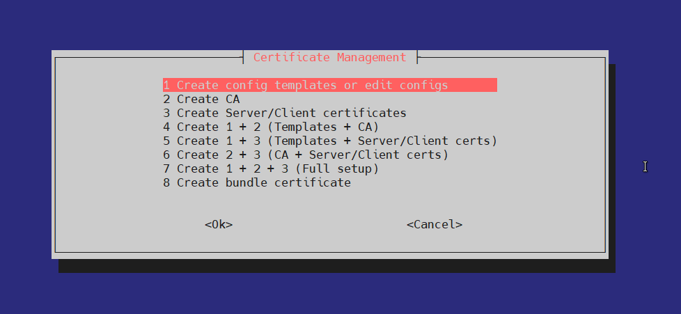
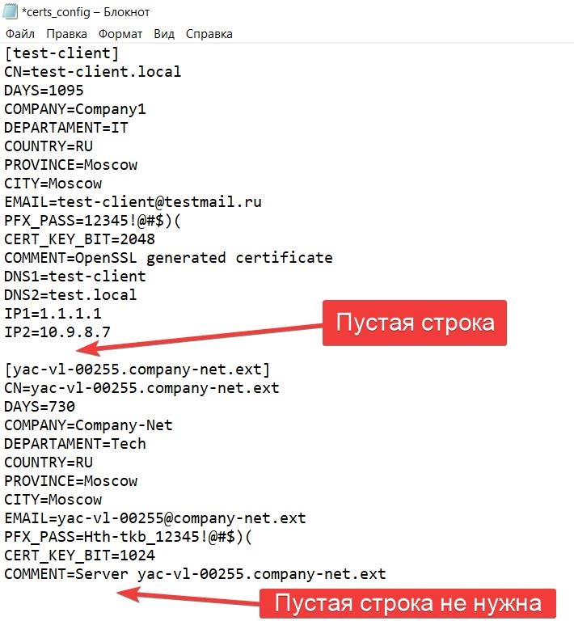

# **Bash script for create CA and Client/Server certificates**

Для работы скрипта необходимо наличие установленных в системе openssl и nano.
## **1 Создать папку. Например**
mkdir -p /tmp/MYCA

Скопировать скрипт в папку.

## **2 Запустить скрипт**
sh /tmp/MYCA/start\_creating\_certs.sh

## **3 Выбрать один из пунктов и следовать инструкциям**

При первоначальном запуске рекомендуется выбирать 7. Create all 1 + 2 + 3

Перед созданием сертификатов необходимо, чтобы непосредственно рядом со скриптом находились файлы-конфигурации:

**env.ini**

**ca\_config.ini**

**certs\_config.ini**

Создать готовые шаблоны можно создать выбрав 1. Create config templates or edit configs

## **Описание и примеры файлов конфигурации**

## **env.ini**
ROOT\_PATH=Пропишется автоматически при выборе 1. Create config templates or edit configs, либо указать вручную абсолютный путь до папки со скриптом, например /tmp/MYCA
CA\_DIR=Имя папки с файлами самого CA
DATA\_DIR=Имя папки с файлами индексами, серийным номером и бэкапом выпущенных сертификатов
CERTS\_DIR=Имя папки с файлами выпущенных сертификатов

## **ca\_config.ini**
[CA]

CA\_CN=MY\_CA
CA\_DAYS=36500
CA\_COMPANY=MyCompany Name
CA\_DEPARTAMENT=IT
CA\_COUNTRY=RU
CA\_PROVINCE=Moscow
CA\_CITY=Moscow
CA\_EMAIL=ca@[testmail.ru](http://testmail.ru)
CA\_PFX\_PASS=Пароль для pfx файла
CA\_KEY\_BIT=Битность ключа
CA\_HASH\_ALG=Алгоритм подписи сертификатов
SERIAL=01

## **При создании CA будут автоматически созданы  все необходимые для работы CA директории на основании конфиг-файла env.ini**

## **certs\_config.ini**
\[custom\_cert\]   Имя папки в которую будут помещены выпущенные сертификаты для данного клиента/сервера, а также все выпущенные сертификаты будут иметь такое же имя файла - не  CN, а именно имя файла (это значение не обязательно должно совпадать с CN, но может с ним совпадать)
CN=custom-client_cert.local.ru
DAYS=10000
COMPANY=Horns and hooves
DEPARTAMENT=Happy department
COUNTRY=RU
PROVINCE=Moscow
CITY=Moscow
EMAIL=custom-client_cert.local.ru@testmail.ru
PFX\_PASS=Пароль для pfx файла
CERT\_KEY\_BIT=Битность ключа
COMMENT=CommentTextString
DNS1=custom-client_cert.local.com
DNS2=custom-client\_cert.local
DNS3=custom-client\_cert
DNS4=custom-client
DNS5=custom
DNS6=\*.local.ru
DNS7=7.ru
DNS8=8.ru
DNS9=9.ru
DNS10=10.ru
IP1=1.1.1.1
IP2=10.9.8.7
IP3=1.1.1.2
IP4=10.9.8.3
IP5=1.1.1.4
IP6=10.9.8.5
IP7=1.1.1.6
IP8=10.9.8.255
IP9=1.1.1.254
IP10=10.9.8.253

## **Сертификаты в файле certs\_config.ini необходимо разделять одной пустой строкой. После последнего сертификата пустая строка не нужна.**

При создании клиентского/серверного сертификата автоматически всегда добавляется SAN равный значению CN.

Также в конфиг файл можно добавить до 10 дополнительных SAN и 10 дополнительных IP.

Если требуется добавить больше или вручную скорректировать параметры создания сертификата, то это можно сделать ответив yes на вопрос

Do you want to manually .cnf file? при создании сертификата

При создании клиентских сертификатов при совпадении имени (то что в квадратных скобках []) папка с соответствующим именем полностью удаляется и создается новая папка с новыми сертификатами.

В папке $DATA\_DIR автоматически создается папка BACKUP куда помещаются копии всех создаваемых сертификатов, включая CA.
